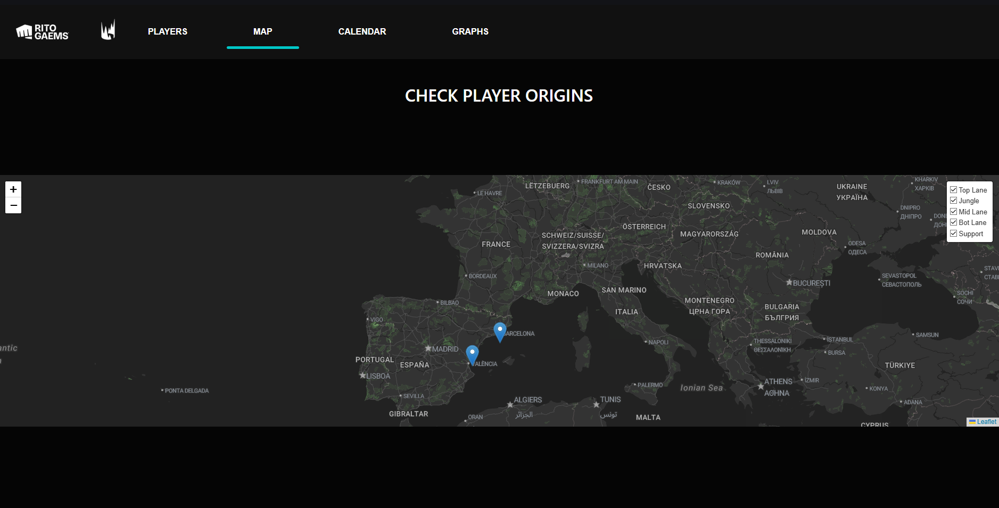

# S8 - League Nexus

League Nexus is a web application that allows users to manage League of Legends players, track their locations on a map, and schedule events such as matches and tournament seasons on an interactive calendar. The application also provides data visualization features with player age and matches per month graphs.



## Project Overview

League Nexus enables users to:
- Create, read, update, and delete player data
- View player locations on an interactive map
- Add and manage events like matches or tournament seasons using a calendar
- Visualize player demographics and match frequency through graphs
- Access all data through a custom API built for this project

## Functionalities

- **API Communication**: Custom backend for data storage and retrieval
- **Event CRUD Operations**: Create, read, update, or delete-- various LoL events
- **Player CRUD Operations**: Complete player management system
- **Interactive Calendar**: Schedule and view events with FullCalendar
- **Interactive Map**: Visual representation of player locations using Leaflet
- **Map Filtering**: Filter map markers by player roles
- **Data Visualization**: Charts displaying player age distribution and match frequency
- **Header Navigation**: Intuitive navigation throughout the application

## Technologies

- Angular 19
- Bootstrap 5
- FullCalendar
- Chart.js
- Leaflet
- Geolocation API
- Jest (Testing)
- Custom API

## Requirements

- Node.js
- Visual Studio Code or similar IDE

---

## Installation Instructions

1. Clone the repository:
   ```
   git clone https://github.com/oscarrep/S8-League-Nexus
   cd S8-League-Nexus
   ```

2. Install dependencies:
   ```
   npm i
   ```

3. Install specific packages:
   ```
   npm i @angular/animations
   npm i ngx-toastr
   npm i jest @types/jest
   npm i @fullcalendar/angular @fullcalendar/core
   npm i leaflet @types/leaflet
   npm i chart.js
   ```

4. Start the development server:
   ```
   ng serve -o
   ```

5. Navigate to `http://localhost:4200/` in your browser to view the application.

---

## Usage

- **Player Management**: Navigate to the Players section to add, edit, or remove player profiles
- **Map View**: Explore the geographical distribution of players on the interactive map
- **Calendar**: Schedule and track events such as tournaments or practice matches
- **Analytics**: View statistical data about player demographics and match frequency


## License

This project is licensed under the MIT License - see the LICENSE file for details.
